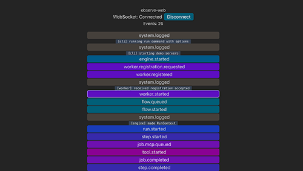

 


# lowercase

### ❗ Alpha Software (v0.1.0-alpha.5)

**lowercase** is in an early alpha stage and still taking shape. Some things work - mostly - but APIs and behaviors will change as development evolves. Expect rough edges and breaking changes for now.

## Overview

**lowercase** is an event driven workflow engine built for flexibility and composability. It's designed to run locally first, as a single process, and aims to make orchestrating complex systems, especially AI driven ones, feel simple, transparent, and powerful. Instead of enforcing rigid rules, **lowercase**'s goal is to make things possible: to connect tools, services, and data streams in whatever way fits your use case.

Under the hood, **lowercase** treats streaming as a first-class citizen. Every component, from queues to workers, communicates through events, allowing generic components with swappable infrastructure. The architecture is modular and extensible, supporting everything from lightweight in-memory execution to distributed setups. Built-in observability is a core goal, with plans for integrated dashboard and support for external monitoring tools, making it easy to understand what your flows are doing at every stage.

## Current State

In brief, currently the system has several in process components: engine, event bus, router, queues, worker, tools, stream, and observability sinks + tap. A cli wires up the runtime, and a vite dev dashboard provides minimal observability.

## Quickstart

### package managers

This monorepo uses [pnpm](https://pnpm.io/) via [Corepack](https://github.com/nodejs/corepack), and can be built with [turborepo](https://turborepo.com/). If you don't have pnpm installed globally, enable corepack (bundled with Node 16.10+):

```bash
corepack enable
```

Post alpha versions of this repo will support other package managers.

### 1. install + build

```bash
pnpm install
pnpm build
```

### 2. run demo

```bash
# start observability dashboard a thttp://localhost:5174/
pnpm -F @lcase/observe-web dev

# run one of the following flows:

# streaming workflow; spawns child server proccesses
pnpm -F @lcase/cli start run examples/demo.streaming.flow.json -d

# non streaming workflow
pnpm -F @lcase/cli start run examples/demo.flow.json -d

# click "connect" on web socket dashboard when ready to run the flow

# when flow is complete, click "disconnect" in observability dashboard
```

### Examples

#### Demo flow executed with two localhost SSE streaming MCP servers


#### Basic Observability WebSocket Event Viewer



### Streaming Flow Explained

#### Streaming Flow Definition ([examples/demo.streaming.flow.json](examples/demo.streaming.flow.json))

The demo streaming flow, when run with the cli run command from repo root, and the `-d` or `--demo` option, performs the following steps:

1. Connects to an observability web socket server.

2. Starts up two localhost MCP servers on ports 3004 and 3005 for each step as child processes. These are found at:

   - [examples/mcp-servers/unicode.server.ts](examples/mcp-servers/unicode.server.ts)
   - [examples/mcp-servers/tranform.server.ts](examples/mcp-servers/transform.server.ts)

3. Wires up the runtime components and queues the flow to run via a `flow.queued` event.

4. The first step named `mario` calls an mcp server and invokes the tool operation named `draw`. It passes args to it to alter its behavior. This tool produces unicode art that resembles mario, streamed from an SSE endpoint. This output is piped to the luigi step.

5. In parallel (single threaded), the step named `luigi` is executed. It contacts an mcp server and runs a tool called `transform` with specific arguments. The interpolated string `$.pipe` refers to the streaming output of the `mario` step. The `transform` tool takes unicode characters and swaps specific colors of characters, to produce a "luigi" styled unicode output. That output is streamed over SSE and not captured in the flow (duplex streaming not yet supported).

6. The engine's `RunContext` is saved as `output.temp.json` in the root of the repo. It contains details about the run, including the output from each step's tool invocation.

See [apps/cli/README.md](apps/cli/README.md) for more details about the cli.

## unit tests

You can run unit tests for the stream core, stream registry, worker, queues, and event emitters.

```

pnpm -r test

```

Further test coverage will grow as the architecture is cemented. Large breaking changes are still in progress.

## Monorepo Packages

| Package                  | Purpose                               |
| ------------------------ | ------------------------------------- |
| **@lcase/types**         | Shared types across packages.         |
| **@lcase/ports**         | Ports and their supporting types.     |
| **@lcase/specs**         | Flow specification.                   |
| **@lcase/events**        | Event schemas and helper functions.   |
| **@lcase/adapters**      | Implementations of ports.             |
| **@lcase/engine**        | Event driven workflow engine.         |
| **@lcase/observability** | Observability events tap and sinks.   |
| **@lcase/cli**           | CLI for running and validating flows. |
| **@lcase/observe-web**   | Vite web observability event viewer.  |
| **@lcase/examples**      | Example / demo flows and servers.     |

## Alpha 5 Highlights: release v0.1.0-alpha.5

### Observability Scaffolded with Lifecycle Events

- New `@lcase/observability` package: scaffolds observability tap and sinks
- New `@lcase/observe-web` package: vite barebones WebSocket observability viewer
- New lifecycle event types in `@lcase/types`
- Update `EmitterFactory` in `@lcase/events` to work with all event types.
- Otel Trace and Span fields integrated into emitters and types
- Zod schemas for all event types, used in event emitters.

## Next for Alpha 6

### Electron Application

- A working electron dashboard.
- Real time run feedback via observability.
- Runtime layer wires up components to run as persistant process controlled through the dashboard.
- Reusable UI for webserver and other versions.
- Reusable use case pipeline logic between different deployments.
- Flow execution from disk `.json` flows.

## Beyond Alpha 6

- New tool types (http, websocket, subprocess, etc)
- New control flow types (branching, parallel, wait, etc)
- Observability persistence for replay / analysis.
- Web server application
- Swappable infra for components.
- Refactor engine for better extensibility
- Refactor worker and tooling boundaries
- Refactor event emitters and otel span creation
