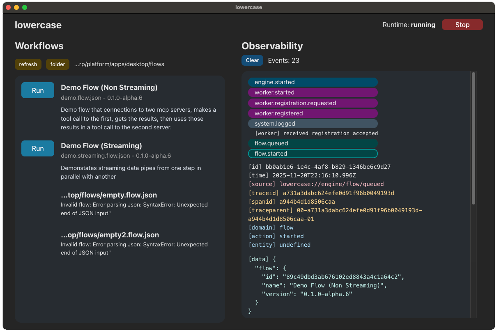

# lowercase

### ❗ Alpha Software (v0.1.0-alpha.6)

**lowercase** is in an early alpha stage and still taking shape. Some things work - mostly - but APIs and behaviors will change as development evolves. Expect rough edges and breaking changes for now.

## Overview

**lowercase** is an event driven workflow engine built for flexibility and composability. It's designed to run locally first, as a single process, and aims to make orchestrating complex systems, especially AI driven ones, feel simple, transparent, and powerful. Instead of enforcing rigid rules, **lowercase**'s goal is to make things possible: to connect tools, services, and data streams in whatever way fits your use case.

Under the hood, **lowercase** treats streaming as a first-class citizen. Every component, from queues to workers, communicates through events, allowing generic components with swappable infrastructure. The architecture is modular and extensible, supporting everything from lightweight in-memory execution to distributed setups. Built-in observability is a core goal, with plans for integrated dashboard and support for external monitoring tools, making it easy to understand what your flows are doing at every stage.

## Current State

In brief, currently the system has several in process components: engine, event bus, router, queues, worker, tools, stream, and observability sinks + tap. An electron desktop app wires up the runtime to run flows. A cli can also run flows and optionally plug into a web socket observability frontend.

## Quickstart

### package managers

This monorepo uses [pnpm](https://pnpm.io/) via [Corepack](https://github.com/nodejs/corepack), and can be built with [turborepo](https://turborepo.com/). If you don't have pnpm installed globally, enable corepack (bundled with Node 16.10+):

```bash
corepack enable
```

Post alpha versions of this repo will support other package managers.

### 1. install + build

```bash
pnpm install
pnpm build
```

### 2. run demo

#### Desktop Demo

```bash
pnpm -F @lcase/desktop dev
```

Basic desktop usage:

- Select a folder that contains flow definitions with the "folder button
- Start the runtime with the "start" button
- Run a flow with the "run" button
- Click on events to see their details, and click "clear" to clear the event list

#### CLI Demo

```bash
# run one of the following flows:

# streaming workflow; spawns child servers
pnpm -F @lcase/cli start run examples/demo.streaming.flow.json -d

# non streaming workflow
pnpm -F @lcase/cli start run examples/demo.flow.json -d

# you may need to terminate the process with ctrl+c or other process signals
```

### Examples

#### Demo flow executed in desktop application



#### Demo flow executed in CLI with two localhost SSE streaming MCP servers


#### Basic Observability WebSocket Event Viewer

This event viewer `@lcase/observe-web` is currently un-wired from the cli by default but can be wired in.


## unit tests

You can run unit tests for the stream core, stream registry, worker, queues, and event emitters.

```

pnpm -r test

```

Further test coverage will grow as the architecture is cemented. Large breaking changes are still in progress.

## Monorepo Packages

| Package                  | Purpose                                    |
| ------------------------ | ------------------------------------------ |
| **@lcase/types**         | Shared types across packages.              |
| **@lcase/ports**         | Ports and their supporting types.          |
| **@lcase/specs**         | Flow specification.                        |
| **@lcase/events**        | Event schemas and helper functions.        |
| **@lcase/adapters**      | Implementations of ports.                  |
| **@lcase/engine**        | Event driven workflow engine.              |
| **@lcase/observability** | Observability events tap and sinks.        |
| **@lcase/runtime**       | Wires up a configurable runtime.           |
| **@lcase/controller**    | Defines an api interface for backend apps. |
| **@lcase/services**      | Implements grouped application logic.      |
| **@lcase/cli**           | CLI for running and validating flows.      |
| **@lcase/desktop**       | Electron desktop application.              |
| **@lcase/observe-web**   | Vite web observability event viewer.       |
| **@lcase/examples**      | Example / demo flows and servers.          |

## Alpha 6 Release Highlights: v0.1.0-alpha.6

### Electron Application

- Working Electron application at `@lcase/desktop`
- Persistent runtime with start/stop.
- Read flows from disk and run them.
- New `@lcase/controller` package for shared API surfaces.
- New `@lcase/services` package for implementing application logic.
- New `@lcase/runtime` to wire up dependencies with a config object.

## Next for Alpha 7

### Flow Control + Tools

- New tool types (http, prompt, RAG, eval, etc)
- New flow control (parallel, join, etc)
- Refactor Engine components
- Refactor Worker and Tools
- Refactor flow definition in typescript with separate schema in `@lcase/specs`
- Refactor Event Emitter otel span creation

## Beyond Alpha 7

- Observability persistence for replay / analysis.
- Web server application.
- Swappable infra (redis) implementation for components.
- Refactor engine for better extensibility.
- Refactor worker and tooling boundaries.
- Refactor event emitters and otel span creation.

## License

This project is licensed under [PolyForm Noncommercial License 1.0.0](https://polyformproject.org/licenses/noncommercial/1.0.0/)

You are free to use, modify, and share the source code for noncommercial purposes, including personal, educational, and research use.

Commercial use is not permitted without permission from the author.
If you're interested in commercial use or have questions, feel free to reach out.
